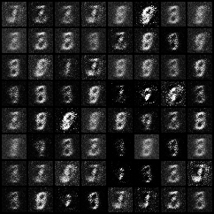
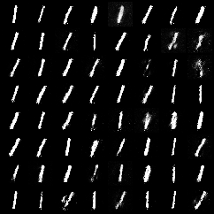
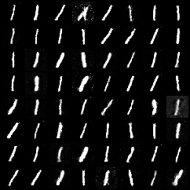
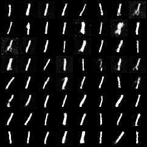
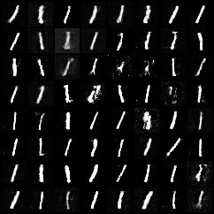

- Epoch 10: 
- Epoch 20: 
- Epoch 30: 
- Epoch 40: 
- Epoch 50: 

```
$ python gan.py
/nix/store/19bmw3mgrh8calqiz0zw4c17qz0nr2dz-python3-3.13.6-env/lib/python3.13/site-packages/torchvision/datasets/mnist.py:76: UserWarning: train_data has been renamed data
  warnings.warn("train_data has been renamed data")
[1/200]: loss_d: 0.168, loss_g: 6.033
[2/200]: loss_d: 0.105, loss_g: 10.323
[3/200]: loss_d: 0.071, loss_g: 7.981
[4/200]: loss_d: 0.018, loss_g: 8.322
[5/200]: loss_d: 0.043, loss_g: 9.525
[6/200]: loss_d: 0.016, loss_g: 8.251
[7/200]: loss_d: 0.051, loss_g: 8.544
[8/200]: loss_d: 0.039, loss_g: 9.435
[9/200]: loss_d: 0.034, loss_g: 9.018
[10/200]: loss_d: 0.049, loss_g: 9.358
[11/200]: loss_d: 0.055, loss_g: 8.683
[12/200]: loss_d: 0.063, loss_g: 8.090
[13/200]: loss_d: 0.062, loss_g: 7.875
[14/200]: loss_d: 0.060, loss_g: 8.033
[15/200]: loss_d: 0.078, loss_g: 7.195
[16/200]: loss_d: 0.092, loss_g: 6.650
[17/200]: loss_d: 0.089, loss_g: 6.457
[18/200]: loss_d: 0.110, loss_g: 5.689
[19/200]: loss_d: 0.138, loss_g: 5.216
[20/200]: loss_d: 0.143, loss_g: 4.862
[21/200]: loss_d: 0.167, loss_g: 4.439
[22/200]: loss_d: 0.183, loss_g: 4.263
[23/200]: loss_d: 0.203, loss_g: 3.931
[24/200]: loss_d: 0.226, loss_g: 3.667
[25/200]: loss_d: 0.244, loss_g: 3.465
[26/200]: loss_d: 0.257, loss_g: 3.345
[27/200]: loss_d: 0.273, loss_g: 3.180
[28/200]: loss_d: 0.277, loss_g: 3.105
[29/200]: loss_d: 0.281, loss_g: 3.090
[30/200]: loss_d: 0.293, loss_g: 2.991
[31/200]: loss_d: 0.291, loss_g: 3.001
[32/200]: loss_d: 0.293, loss_g: 3.037
[33/200]: loss_d: 0.315, loss_g: 2.815
[34/200]: loss_d: 0.319, loss_g: 2.756
[35/200]: loss_d: 0.315, loss_g: 2.802
[36/200]: loss_d: 0.318, loss_g: 2.783
[37/200]: loss_d: 0.324, loss_g: 2.734
[38/200]: loss_d: 0.327, loss_g: 2.772
[39/200]: loss_d: 0.326, loss_g: 2.800
[40/200]: loss_d: 0.327, loss_g: 2.822
[41/200]: loss_d: 0.323, loss_g: 2.820
[42/200]: loss_d: 0.328, loss_g: 2.777
[43/200]: loss_d: 0.330, loss_g: 2.867
[44/200]: loss_d: 0.323, loss_g: 2.910
[45/200]: loss_d: 0.324, loss_g: 2.865
[46/200]: loss_d: 0.330, loss_g: 2.807
[47/200]: loss_d: 0.325, loss_g: 2.888
[48/200]: loss_d: 0.342, loss_g: 2.685
[49/200]: loss_d: 0.344, loss_g: 2.731
[50/200]: loss_d: 0.350, loss_g: 2.652
```
